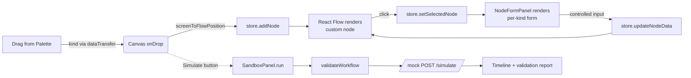

<p align="center">
  
  
  
  
  
  
</p>

<p align="center">
  
</p>

<h1 align="center">HR Workflow Designer</h1>
<h3 align="center">A Visual Canvas for HR Operations — drag, configure, simulate.</h3>

<p align="center">
  <i>An enterprise-grade prototype that lets an HR admin compose internal workflows — onboarding, leave approval, document verification — with a drag-and-drop canvas, dynamic configuration forms, and a live simulation sandbox. Built from scratch in the Tredence case-study 4–6 hour time-box.</i>
</p>

<p align="center">
  <a href="#the-brief">Brief</a> &middot;
  <a href="#the-solution">Solution</a> &middot;
  <a href="#submission-checklist">Deliverables</a> &middot;
  <a href="#how-it-works">How It Works</a> &middot;
  <a href="#architecture">Architecture</a> &middot;
  <a href="#data-model">Data Model</a> &middot;
  <a href="#mock-api">Mock API</a> &middot;
  <a href="#robustness-layer">Robustness</a> &middot;
  <a href="#testing--ci">Testing &amp; CI</a> &middot;
  <a href="#tech-stack">Tech Stack</a> &middot;
  <a href="#getting-started">Getting Started</a> &middot;
  <a href="#deployment">Deployment</a> &middot;
  <a href="#extensibility">Extensibility</a> &middot;
  <a href="#design-decisions">Design Decisions</a>
</p>

<p align="center">
  <a href="https://hr-flow.ushamroy.com">
    
  </a>
  <a href="https://github.com/uroy80/Tredence">
    
  </a>
  <a href="#getting-started">
    
  </a>
  <a href="#tech-stack">
    
  </a>
  <a href="https://react.dev">
    
  </a>
  <a href="https://www.typescriptlang.org/">
    
  </a>
  <a href="https://reactflow.dev">
    
  </a>
  <a href="https://vite.dev">
    
  </a>
  <a href="https://tailwindcss.com">
    
  </a>
  <a href="https://zustand.docs.pmnd.rs/">
    
  </a>
  <a href="https://zod.dev">
    
  </a>
  <a href="https://vitest.dev">
    
  </a>
</p>

---

## Submission Checklist

| Deliverable                            | Where                                                          | Status     |
|----------------------------------------|----------------------------------------------------------------|------------|
| **Live deployment**                    | [hr-flow.ushamroy.com](https://hr-flow.ushamroy.com) · AlmaLinux VPS behind Cloudflare | Delivered |
| **Git repository**                     | [github.com/uroy80/Tredence](https://github.com/uroy80/Tredence) | Delivered  |
| **React app (Vite / Next.js)**         | [`vite.config.ts`](vite.config.ts) · React 19 + TS             | Delivered  |
| **React Flow canvas w/ custom nodes**  | [`src/features/workflow/canvas`](src/features/workflow/canvas) | Delivered  |
| **Node configuration forms (per type)**| [`src/features/workflow/forms`](src/features/workflow/forms)   | Delivered  |
| **Mock API** (`GET /automations`, `POST /simulate`) | [`src/api`](src/api)                              | Delivered  |
| **Sandbox / test panel**               | [`src/features/workflow/sandbox`](src/features/workflow/sandbox) | Delivered |
| **README — architecture, design, assumptions** | this file                                              | Delivered  |
| **Import / Export workflow JSON** *(bonus)*    | [`Toolbar.tsx`](src/features/workflow/toolbar/Toolbar.tsx) | Delivered |
| **Cycle + reachability validation** *(bonus)*  | [`utils/validation.ts`](src/utils/validation.ts)       | Delivered  |
| **Undo / Redo** *(bonus)*                      | Zundo middleware in [`store/workflowStore.ts`](src/store/workflowStore.ts) | Delivered |
| **Mini-map + zoom controls** *(bonus)*         | [`Canvas.tsx`](src/features/workflow/canvas/Canvas.tsx) | Delivered |
| **Dark mode**                          | [`useTheme.ts`](src/hooks/useTheme.ts)                          | Delivered  |
| **Unit tests + CI**                    | [`src/**/*.test.ts`](src) + [`.github/workflows/ci.yml`](.github/workflows/ci.yml) | Delivered |

---

## The Brief

> **Build a mini HR Workflow Designer module where an HR admin can visually create and test internal workflows such as onboarding, leave approval, or document verification.**
>
> — Tredence Analytics, Full Stack Engineering Intern case study

The prompt is time-boxed to **4–6 hours** and explicitly asks evaluators to grade
for **architectural clarity and working functionality, not pixel-perfect UI**.
Everything below is scoped with that constraint in mind — but the codebase is
also structured so that every "wouldn't it be great if…" extension is a
one-file change.

### Assessment rubric

| Area                    | What reviewers look for                                  | Where in this repo                                                                             |
|-------------------------|----------------------------------------------------------|------------------------------------------------------------------------------------------------|
| React Flow proficiency  | Custom nodes, positioning, edge management               | [`canvas/`](src/features/workflow/canvas) · [`nodes/`](src/features/workflow/nodes)            |
| React architecture      | Hooks, context, folder structure                         | [`store/`](src/store) · [`hooks/`](src/hooks) · [`features/`](src/features)                    |
| Complex form handling   | Dynamic per-kind fields, validation                      | [`forms/`](src/features/workflow/forms) · [`AutomatedNodeForm.tsx`](src/features/workflow/forms/AutomatedNodeForm.tsx) |
| Mock API interaction    | Data layer, async patterns, abstraction                  | [`api/`](src/api) · [`hooks/useAutomations.ts`](src/hooks/useAutomations.ts)                   |
| Scalability             | Is the solution extensible?                              | [`nodeRegistry.ts`](src/features/workflow/nodes/nodeRegistry.ts) + discriminated union         |
| Communication           | README, assumptions, design notes                        | this file · inline types                                                                       |
| Delivery speed          | Can a senior engineer ship value fast?                   | `git log --oneline`                                                                            |

---

## The Solution

A **visual workflow designer** module that ships four things the spec asks for,
plus a robustness layer that makes it look and feel like a real product:

<p align="center">
  
  
  
  
</p>

**Five first-class node types** — Start, Task, Approval, Automated Step, End —
each with its own shaped data, its own form, its own simulation behaviour, and
its own palette accent. All driven by a single discriminated union so the
compiler catches every missed case.

**Live simulation** — click *Simulate* (or hit `⌘↵`) to validate the graph and
walk it step-by-step, with per-node status, elapsed timings, and locate-on-canvas
deep-links.

**Enterprise polish** — undo/redo, auto-save, toast notifications, confirmation
dialogs, focus-trapped modals, schema-validated JSON import, keyboard shortcuts,
dark mode, 32-test Vitest suite, and a two-matrix CI pipeline.

---

## How It Works



1. **Drag** a node kind from the left palette onto the canvas.
2. **Connect** nodes by dragging between the circular handles (self-loops and
   duplicates are silently blocked).
3. **Click** a node to open the right-hand inspector and edit its fields. The
   inspector form is per-kind — it reshapes itself for Start / Task / Approval /
   Automated / End.
4. **Simulate** at any time — the sandbox validates the graph, DFS-walks it from
   the Start node, and streams a timeline of OK / SKIP / ERR / INFO steps.
5. Workflows **auto-save** to `localStorage` on every change (schema-versioned,
   with silent fallback on mismatch) and can be **exported as JSON** for sharing
   or re-import.

### Canvas shortcuts

| Shortcut                       | Action                          |
|--------------------------------|---------------------------------|
| `⌘Z` / `Ctrl+Z`                | Undo                            |
| `⌘⇧Z` / `Ctrl+Y`               | Redo                            |
| `⌘S` / `Ctrl+S`                | Export workflow JSON            |
| `⌘↵` / `Ctrl+Enter`            | Open the simulator              |
| `Esc`                          | Close sandbox / deselect        |
| `Backspace` / `Del`            | Delete selected node or edge    |

---

## Architecture

The app is a single **feature module** (`src/features/workflow/`) with a clear
separation between UI shell, state, and services.

```
┌───────────────────────────────────────────────────────────┐
│                         App shell                         │
│  (Toolbar · Sidebar · Canvas · Inspector · Sandbox modal) │
│           ErrorBoundary  ·  Toasts  ·  ConfirmDialog      │
└───────────────────────────────────────────────────────────┘
                             │
           ┌─────────────────┼──────────────────┐
           │                 │                  │
   Zustand + Zundo store  Toast store    Confirm store
     (temporal history)    (notify UX)   (async confirm)
           │
           ▼
 Shared types + utils (discriminated unions · validation
                       · persistence · hotkeys · logger)
           │
           ▼
   Mock API layer (/automations, /simulate) ← swappable for real fetch
           │
           ▼
   localStorage (schema-versioned, Zod-validated)
```

- **`store/workflowStore.ts`** is the single source of truth, wrapped in the
  **Zundo temporal middleware** for undo/redo. Every mutation flows through the
  store — history, persistence, and any future collaboration layer only need
  one hook point.
- **`api/`** is promise-based and deliberately shaped like a `fetch` wrapper —
  swapping it for a real REST client or MSW is a one-file change.
- **`nodeRegistry.ts`** is the *only* place that maps a `NodeKind` to defaults,
  label, and accent. Adding a new node kind touches the registry, the type
  union, and one form — **no canvas or store changes**.
- **`utils/validation.ts`** is pure and is reused by both the `/simulate`
  endpoint and the sandbox UI. Validation is authoritative in one place.

### Project structure

```
src/
├── api/                              # Mock API layer
│   ├── automations.ts                # GET /automations
│   └── simulate.ts                   # POST /simulate (pure, unit-tested)
├── components/
│   ├── ConfirmDialog.tsx             # Promise-based confirm (replaces window.confirm)
│   ├── ErrorBoundary.tsx             # React error boundary with logger integration
│   ├── Toasts.tsx                    # Portal-rendered toast stack
│   ├── icons.tsx                     # Inline SVG icon set
│   └── ui/                           # Generic primitives (Button, Field, KeyValueEditor)
├── features/workflow/
│   ├── canvas/Canvas.tsx             # React Flow surface + drop handling
│   ├── forms/                        # Per-kind configuration forms
│   ├── nodes/                        # Custom node components + registry
│   ├── sandbox/SandboxPanel.tsx      # Simulate + timeline + focus-trapped modal
│   ├── sidebar/Sidebar.tsx           # Draggable palette
│   └── toolbar/Toolbar.tsx           # Undo/redo · import/export/reset · simulate
├── hooks/
│   ├── useAutomations.ts             # Cached /automations fetch
│   ├── useHotkeys.ts                 # Cross-platform shortcuts
│   └── useTheme.ts                   # Light / dark / system
├── store/
│   ├── workflowStore.ts              # Zustand + Zundo + persist
│   ├── toastStore.ts
│   └── confirmStore.ts
├── types/workflow.ts                 # Discriminated union of node data
├── utils/
│   ├── validation.ts                 # Cycle + reachability + field checks
│   ├── persistence.ts                # Zod schema + localStorage
│   └── logger.ts                     # Pluggable structured logger
├── test/setup.ts                     # Vitest bootstrap
├── App.tsx                           # Layout shell + global hotkeys
├── index.css                         # Tailwind tokens + dark-mode swap
└── main.tsx
```

---

## Data Model

The core contract is a **discriminated union on `kind`**:

```ts
type WorkflowNodeData =
  | StartNodeData     // { kind: 'start',     title, metadata[] }
  | TaskNodeData      // { kind: 'task',      title, description, assignee, dueDate, customFields[] }
  | ApprovalNodeData  // { kind: 'approval',  title, approverRole, autoApproveThreshold }
  | AutomatedNodeData // { kind: 'automated', title, actionId, actionParams }
  | EndNodeData;      // { kind: 'end',       message, summary }

type WorkflowNode =
  | StartNode | TaskNode | ApprovalNode | AutomatedNode | EndNode;

type WorkflowGraph = { nodes: WorkflowNode[]; edges: Edge[] };
```

Because `kind` is the discriminator, TypeScript narrows correctly inside forms,
the simulate engine, and the persistence layer. `switch (data.kind)` exhausts
the union — **no `as` casts in the happy path.**

The same shape is mirrored as a **Zod schema** in [`utils/persistence.ts`](src/utils/persistence.ts):

```ts
const NodeDataSchema = z.discriminatedUnion('kind', [ /* ... */ ]);
const GraphSchema    = z.object({
  nodes: z.array(NodeSchema).max(500),
  edges: z.array(EdgeSchema).max(2000),
});
const PersistedSchema = z.object({
  version: z.number(),
  graph:   GraphSchema,
  savedAt: z.string(),
});
```

Every uploaded JSON file is **size-limited (2 MB hard cap)** and validated
against this schema before it ever touches the store. Malformed imports produce
a scoped error toast with the first schema violation; nothing else leaks in.

---

## Node Types

| Kind         | Purpose                                 | Required Fields                                                  |
|--------------|-----------------------------------------|------------------------------------------------------------------|
| **Start**    | Entry point (exactly one per workflow)  | title, metadata key-value pairs                                  |
| **Task**     | Human task                              | title <sup>\*</sup>, description, assignee, due date, custom KV  |
| **Approval** | Manager / HRBP / Director / CEO         | title <sup>\*</sup>, approver role, auto-approve threshold       |
| **Automated**| System-triggered action                 | title, action from `/automations`, dynamic action params         |
| **End**      | Workflow completion (terminal)          | end message, summary flag                                        |

<sup>\*</sup> required — forms surface inline errors for empty required fields.

---

## Mock API

Location: [`src/api/`](src/api). Promise-based and deliberately shaped like a
`fetch` wrapper.

### `GET /automations` — [`api/automations.ts`](src/api/automations.ts)

Returns five seeded actions:

```json
[
  { "id": "send_email",      "label": "Send Email",          "params": ["to", "subject", "body"] },
  { "id": "generate_doc",    "label": "Generate Document",   "params": ["template", "recipient"] },
  { "id": "create_ticket",   "label": "Create Ticket",       "params": ["queue", "priority", "summary"] },
  { "id": "provision_account","label":"Provision Account",   "params": ["system", "role"] },
  { "id": "post_slack",      "label": "Post to Slack",       "params": ["channel", "message"] }
]
```

Each definition ships a `params: string[]` — the **Automated Step form builds
its inputs dynamically** from this list, so adding a new parameter to an action
requires zero UI changes.

`useAutomations()` de-duplicates in-flight requests and caches the result
module-scope, so multiple Automated nodes opened in sequence share a single
network call.

### `POST /simulate` — [`api/simulate.ts`](src/api/simulate.ts)

- Runs the **same validation the UI runs** (single source of truth).
- If validation fails, returns `{ ok: false, steps: [...errors] }`.
- Otherwise DFS-walks the graph from the Start node, one step per reachable
  node. Unreachable nodes are appended as `SKIP` entries.
- Each step reports `kind`, `title`, status (`ok | info | skipped | error`),
  a human-readable `message`, and a cumulative `elapsedMs`.
- Automated steps are "executed" against their bound action + params; missing
  required params surface as per-step errors.

---

## Validation & Simulation

[`utils/validation.ts`](src/utils/validation.ts) owns structural checks. It runs
in **O(V + E)** and returns both errors (block simulation) and warnings
(informational):

| Issue                                            | Severity |
|--------------------------------------------------|----------|
| No Start node                                    | error    |
| More than one Start node                         | error    |
| Start node has incoming edges                    | error    |
| End node has outgoing edges                      | error    |
| Task / Approval with empty required title        | error    |
| Automated step with no action selected           | error    |
| Graph contains a cycle                           | error    |
| No End node present                              | warning  |
| End node unreachable from Start                  | warning  |
| Intermediate node with no incoming or outgoing   | warning  |

Cycle detection uses DFS with WHITE/GRAY/BLACK colouring. Reachability uses
BFS from the Start node.

---

## Robustness Layer

Everything above the spec that makes this feel like a production module.

| Capability                | Where                                                                                   |
|---------------------------|-----------------------------------------------------------------------------------------|
| Nested error boundaries   | [`ErrorBoundary.tsx`](src/components/ErrorBoundary.tsx) — per-pane, logs to sink        |
| Structured logger         | [`logger.ts`](src/utils/logger.ts) — `registerSink()` for Sentry / Datadog plug-in      |
| Toast notifications       | [`toastStore.ts`](src/store/toastStore.ts) + [`Toasts.tsx`](src/components/Toasts.tsx)  |
| Promise-based confirm     | [`confirmStore.ts`](src/store/confirmStore.ts) + keyboard-operable dialog               |
| Undo / Redo               | Zundo temporal middleware (limit 50) in [`workflowStore.ts`](src/store/workflowStore.ts) |
| localStorage auto-save    | Schema-versioned via Zod; silent fallback on mismatch                                   |
| Import hardening          | Zod discriminated-union schema + 2 MB size cap + toast error reporting                  |
| Keyboard shortcuts        | [`useHotkeys.ts`](src/hooks/useHotkeys.ts) — cross-platform `mod` + input suppression   |
| Focus management          | Sandbox focus-trap, Escape-to-close, confirm auto-focus, focus-visible rings            |
| Dark mode                 | [`useTheme.ts`](src/hooks/useTheme.ts) — system preference + persistence, no FOUC       |
| Duplicate/self-loop guard | Store rejects invalid connections                                                       |

---

## Testing & CI

**32 unit tests across 5 files** using Vitest + happy-dom + React Testing Library.

| File                                              | Coverage                                                           |
|---------------------------------------------------|--------------------------------------------------------------------|
| [`utils/validation.test.ts`](src/utils/validation.test.ts) | Start / End / orphan / cycle / reachability / title / action |
| [`utils/persistence.test.ts`](src/utils/persistence.test.ts) | Zod parse, size limits, localStorage roundtrip, versioning |
| [`api/simulate.test.ts`](src/api/simulate.test.ts)         | Linear traversal, orphans, param validation, cycle halt      |
| [`store/workflowStore.test.ts`](src/store/workflowStore.test.ts) | CRUD, edge guards, undo/redo round-trip                |
| [`hooks/useHotkeys.test.ts`](src/hooks/useHotkeys.test.ts) | Combo matching, input suppression, shift variants            |

```bash
npm test            # single run (what CI runs)
npm run test:watch  # interactive
npm run test:ui     # browser-based explorer
```

**GitHub Actions CI** — [`.github/workflows/ci.yml`](.github/workflows/ci.yml)
runs on every push and PR to `main` across Node 20 and 22. Each job:

```
lint → typecheck → test → build → upload dist/ artifact
```

---

## Tech Stack

<p align="center">
  
  
  
  
  
  
  
  
  
  
  
  
  
</p>

| Layer        | Pick                         | Why                                                                |
|--------------|------------------------------|---------------------------------------------------------------------|
| Framework    | React 19 + Vite 8            | HMR, fast cold starts, no Next.js routing needed for a single-view  |
| Language     | TypeScript (strict)          | `noUnusedLocals`, `noUnusedParameters`, no `any`                    |
| Canvas       | `@xyflow/react` v12          | Official React Flow, best-in-class for node graphs                  |
| Styling      | Tailwind v4 + CSS variables  | Zero-config via Vite plugin; `@theme` tokens drive light/dark swap  |
| State        | Zustand 5 + Zundo            | Minimal boilerplate; undo/redo drops in as middleware               |
| Validation   | Zod                          | Mirrors the TS union; single source of truth for import safety     |
| Testing      | Vitest + RTL + happy-dom     | Fast, Vite-native, zero config                                      |
| Lint         | ESLint 9 + typescript-eslint | No `any`, no `console.log`, consistent type imports                 |

---

## Getting Started

```bash
git clone https://github.com/uroy80/Tredence
cd Tredence/hr-workflow-designer

npm install
npm run dev        # http://localhost:5173
```

### Scripts

| Command              | Purpose                                                    |
|----------------------|------------------------------------------------------------|
| `npm run dev`        | Vite dev server with HMR                                   |
| `npm run build`      | Type-check + production build (`dist/`)                    |
| `npm run preview`    | Serve the production build locally                         |
| `npm run lint`       | ESLint — fails on `any`, `console.log`, `alert`            |
| `npm run typecheck`  | `tsc -b --noEmit`                                          |
| `npm test`           | Vitest run — what CI runs                                  |
| `npm run test:watch` | Vitest watch mode                                          |
| `npm run test:ui`    | Vitest UI (browser-based test explorer)                    |

### Full verification (what CI runs)

```bash
npm run lint && npm run typecheck && npm test && npm run build
```

**Requirements:** Node ≥ 20.

---

## Deployment

Live at **[hr-flow.ushamroy.com](https://hr-flow.ushamroy.com)**.

### Stack

```
  Cloudflare (Full-strict SSL, proxied A record)
            │
            ▼
  Origin VPS · AlmaLinux 10
            │
            ▼
  shared-nginx (nginx:alpine, Docker) — multi-vhost reverse proxy
    ├─ srm-gtl.com         → hub-srm-portal
    ├─ staff.srm-gtl.com   → hub-gw-user-hub
    ├─ hub.srm-gtl.com     → hub-admin-dashboard
    ├─ hr-flow.ushamroy.com  → /app/hr-flow  (this project — static SPA)
    └─ _ (default)           → /app/frontend (GigShield)
```

The shared reverse-proxy container fronts three independent app stacks
(Guidewire integration hub, GigShield Q-commerce, and this one). Each gets
its own cert, its own server block, its own bind-mounted static root — no
shared state between them.

### Server layout (isolated from the other two stacks)

```
/root/hr-flow/dist/                 ← production bundle (bind-mounted read-only)
/root/shared-nginx/nginx.conf       ← one shared vhost file; this project owns one server block
/root/shared-nginx/ssl/
  ├─ ushamroy.com.crt               ← Cloudflare Origin Certificate (SAN: *.ushamroy.com, ushamroy.com)
  └─ ushamroy.com.key               ← private key (chmod 600)
```

The Docker container mounts include:

```
-v /root/shared-nginx/nginx.conf:/etc/nginx/nginx.conf:ro
-v /root/shared-nginx/ssl/ushamroy.com.crt:/etc/ssl/certs/ushamroy.com.crt:ro
-v /root/shared-nginx/ssl/ushamroy.com.key:/etc/ssl/private/ushamroy.com.key:ro
-v /root/hr-flow/dist:/app/hr-flow:ro
```

### Nginx server block

```nginx
server {
    listen 443 ssl;
    http2 on;
    server_name hr-flow.ushamroy.com;

    ssl_certificate     /etc/ssl/certs/ushamroy.com.crt;
    ssl_certificate_key /etc/ssl/private/ushamroy.com.key;
    ssl_protocols TLSv1.2 TLSv1.3;

    add_header Strict-Transport-Security "max-age=31536000" always;
    add_header X-Content-Type-Options "nosniff" always;
    add_header Referrer-Policy "strict-origin-when-cross-origin" always;
    add_header X-Frame-Options "SAMEORIGIN" always;

    root /app/hr-flow;
    index index.html;

    # Long-cache hashed assets (Vite appends content-hash to every file in /assets)
    location /assets/ {
        expires 1y;
        add_header Cache-Control "public, immutable";
        try_files $uri =404;
    }

    # SPA fallback
    location / {
        try_files $uri $uri/ /index.html;
    }
}
```

### Redeploy

Static files only — no container restart needed, the bind mount is live.

```bash
npm run build
rsync -az --delete -e "ssh -i ~/.ssh/origin_vps" \
  dist/ root@&lt;origin-host&gt;:/root/hr-flow/dist/
```

Vite content-hashes every asset, so old-bundle links continue to resolve while
the new `index.html` points at new hashes — zero-downtime swap.

### Rotate the origin certificate

Cloudflare dashboard → SSL/TLS → Origin Server → revoke + reissue, then:

```bash
scp -i ~/.ssh/origin_vps new-cert.pem root@&lt;origin-host&gt;:/root/shared-nginx/ssl/ushamroy.com.crt
scp -i ~/.ssh/origin_vps new-cert.key root@&lt;origin-host&gt;:/root/shared-nginx/ssl/ushamroy.com.key
ssh  -i ~/.ssh/origin_vps root@&lt;origin-host&gt; \
  'chmod 600 /root/shared-nginx/ssl/ushamroy.com.key && docker exec shared-nginx nginx -s reload'
```

### Observability

```bash
ssh -i ~/.ssh/origin_vps root@&lt;origin-host&gt; 'docker logs --tail 100 shared-nginx'
```

---

## Extensibility

Adding a new node type — say `NotificationNode` — is **exactly four files**:

1. **[`types/workflow.ts`](src/types/workflow.ts)** — add `NotificationNodeData`
   to the union and `'notification'` to `NODE_KINDS`. Mirror in the Zod
   `NodeDataSchema`.
2. **[`nodeRegistry.ts`](src/features/workflow/nodes/nodeRegistry.ts)** —
   register defaults, label, accent.
3. **[`nodeTypes.tsx`](src/features/workflow/nodes/nodeTypes.tsx)** +
   [`nodeTypesMap.ts`](src/features/workflow/nodes/nodeTypesMap.ts) — add a
   thin wrapper over `NodeShell`.
4. **`forms/NotificationNodeForm.tsx`** + one case in
   [`NodeFormPanel`](src/features/workflow/forms/NodeFormPanel.tsx)'s switch.

No changes to the canvas, store, sidebar, toolbar, sandbox, or validation
engine are required — the registry drives the palette and defaults, the
discriminated union drives the form switch, and validation short-circuits on
kinds it doesn't recognize. **This was an explicit design goal.**

---

## Design Decisions

**Why Zustand + Zundo instead of Context / Redux + redux-undo?**
Zustand is three lines of boilerplate, and Zundo's `temporal` middleware adds
undo/redo without changing a single action shape. Context would cause whole-tree
re-renders on every node drag; Redux is overkill for the action surface.

**Why discriminated unions over a generic `Node<T>`?**
`NodeProps<StartNode>` etc. give each form and each custom component fully
typed `data`. No `as` casts inside components; `switch (data.kind)` exhausts
the union. The same contract is mirrored one layer out in Zod.

**Why in-process mocks instead of MSW / JSON Server?**
MSW requires a service-worker install dance and JSON Server requires a second
process. For a time-boxed case study the in-process layer is cheaper, equally
swap-able, and doesn't break previews. The module still speaks *Promise* so
replacing it with `fetch()` is a one-file change.

**Why render the entire Automated Step form from `params: string[]`?**
The brief explicitly calls out *"Action parameters (dynamic based on mock
action definition)"*. Building the form from API-driven metadata is a direct
answer — users watch the inspector rebuild itself when they switch actions.

**Why one `NodeShell` instead of five hand-crafted node visuals?**
Consistency ships faster, restyles globally, and keeps the accent-colour system
in one place. Each node variant supplies its own icon, subtitle, and optional
footer — the shell handles handles, selection ring, and the coloured chip.

**Why Tailwind v4?**
Zero-config via the Vite plugin, and `@theme { --color-* }` tokens give
semantic colour names that map cleanly to node kinds. Dark mode swaps by
redefining the same variables under `[data-theme="dark"]`.

**Why a schema-versioned localStorage blob?**
The moment the shape changes (add a field, rename a kind), unversioned data
crashes the app on next boot. A single `version: 1` check with a Zod parse lets
us bump the schema and fall back gracefully instead of wedging users.

---

## What I'd Ship Next

- **E2E Playwright** for the drag → connect → edit → simulate flow.
- **Visual validation on nodes** — red outline on failing nodes, not just in the sandbox.
- **Auto-layout** via `@dagrejs/dagre` behind a toolbar button.
- **Node templates** — save a configured subgraph as a reusable block.
- **Per-workflow slots in localStorage** so admins juggle multiple drafts.
- **Storybook** for the UI primitives so they can be reused across HR tooling.
- **Remote persistence** — swap the localStorage layer for a real backend, same schema.
- **A11y pass** — keyboard fallback for the drag-and-drop palette.

---

## Credits

<p align="center">
  <i>Built by Usham Roy for Tredence Analytics — Full Stack Engineering Intern case study.</i>
</p>

<p align="center">
  <a href="https://github.com/uroy80">
    
  </a>
  <a href="https://www.tredence.com/">
    
  </a>
  <a href="https://reactflow.dev">
    
  </a>
</p>
